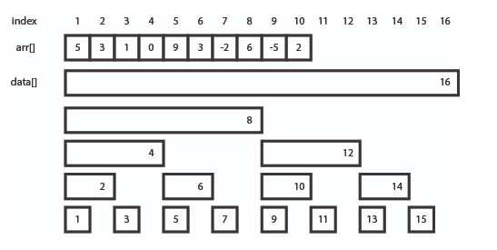

# Guide to Competitive Programming: Learning and Improving Algorithms Through Contests

 

### binnaryIndexedTree

 

> 이진 인덱스 트리(Binary indexed tree), 혹은 펜윅 트리(Fenwick tree)는 누적 합 배열의 동적인 변종이라고 볼 수 있는 자료 구조이다. 이 자료 구조는 O(log n) 시간이 걸리는 연산 두 가지를 지원한다. 이진 인덱스 트리에 대한 내용을 다룰 때는 모든 배열의 인덱스가 1부터 시작한다고 가정한다. 그래야 자료 구조를 좀 더 쉽게 구현할 수 있기 때문이다.

 

 

> 위 그림에 모든 것이 설명되어 있긴 하지만, 자세히 살펴보자. i는 0 이상인 정수이다. <ol><li>인덱스가 홀수인 원소는 수열의 해당 인덱스의 값을 그대로 가진다.

<ol><li><math xmlns="http://www.w3.org/1998/Math/MathML"><mi>d</mi><mi>a</mi><mi>t</mi><mi>a</mi><mo stretchy="false">[</mo><mn>2</mn><mi>i</mi><mo>+</mo><mn>1</mn><mo stretchy="false">]</mo><mo>=</mo><mi>a</mi><mi>r</mi><mi>r</mi><mo stretchy="false">[</mo><mn>2</mn><mi>i</mi><mo>+</mo><mn>1</mn><mo stretchy="false">]</mo></math></li><li>data[1] = arr[1], data[3] = arr[3], …</li></ol>
</ol>
</li>
 
