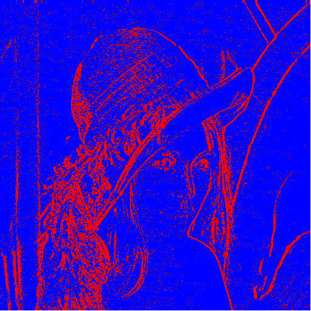

# Edge Detected

 

> 엣지 검출은 다양한 포함 수학 식별 목표 방법 가장자리 , 곡선 A의 디지털 화상 하는 화상 밝기 또는 형식적 갖는다 급격히 변화 불연속 . 1차원 신호에서 불연속성을 찾는 동일한 문제를 단계 감지 라고 하고 시간이 지남에 따라 신호 불연속성을 찾는 문제를 변경 감지라고 합니다. 에지 감지는 특히 특징 감지 영역 에서 이미지 처리 , 머신 비전 및 컴퓨터 비전 의 기본 도구입니다.및 특징 추출 .

 

 
 

> 2차원 이미지에서 각각의 픽셀의 색 데이터(R, G, B) , 투명도는 무시한다
> 3차원 공간에서 각각의 축을 R, G, B 라고 생각
> 각각의 축은 255가 최대
> 2차원 이미지에서의 각각의 픽셀의 색 데이터를 3차원 R, G, B 축으로 만들어진 공간에 넣으면
> 공간에서의 점으로 표시가 된다.
> 해당 점과 주변 점을 검사하여 변화량이 큰 경우 edge 로 판단한다.
> 여기서 검사란
> 3차원 R, G, B 축으로 이루어진 공간에서 해당 점과 검사할 점의 벡터의 절대값으로 계산을 하고
> edge 로 판단하는 기준을 잡아 해당 기준보다 큰 경우 edge로 판단한다.
> edge 로 판단하는 기준을 잡는 방법은 생각중...(input 값으로 지정할 수 있도록) 크면 클 수록 edge 로 판단하지 않는다.

 

### Reference

 

> https://en.wikipedia.org/wiki/Edge_detection

 
